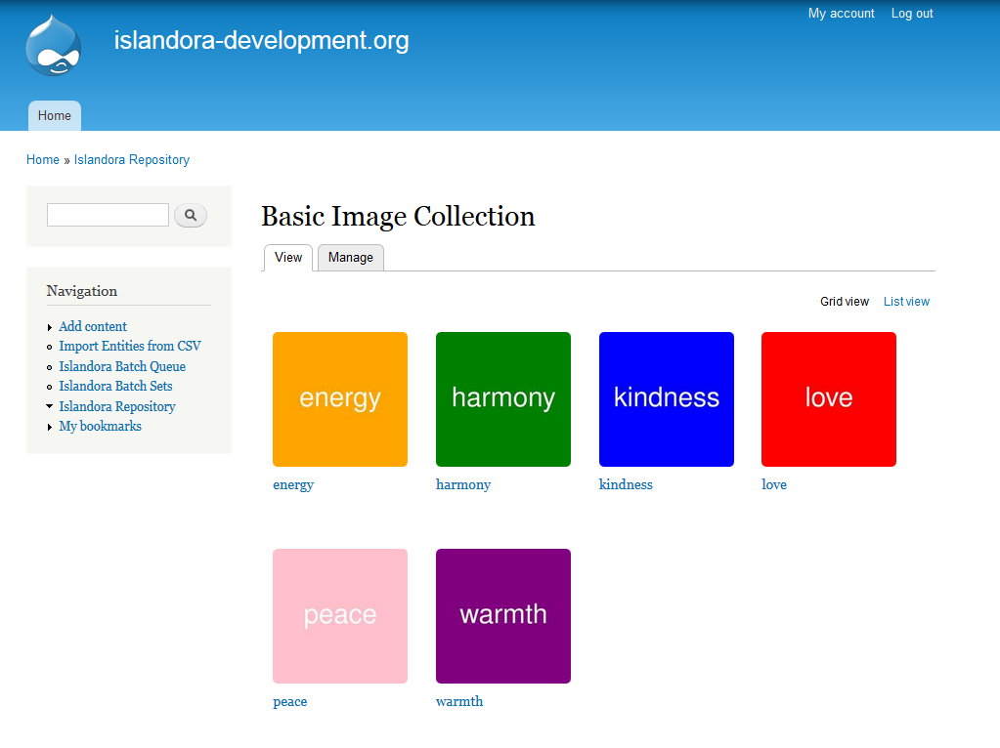

# Islandora Groovy

Drush script that generates some groovy images and then batch loads them into Islandora. The thumbnails look like this:



## Prerequisites

* Islandora
* Islandora Batch
* Islandora Basic Image Collection

## Usage

```drush igroovy```
